# CLICK & READ 📚

## Description 📄

CLICK AND READ is a book e-commerce, where every user will have the possibility to buy or sell books, new or used.

---

## TechStack 💻

- HTML-CSS
- SASS
- JavaScript
- React
- Redux Toolkit
- Node
- Express
- Mongo - Mongoose

---

## Functionalities  ✔

- Create an account through traditional mail or access through a Google account.
- Email notification for account verification and password recovery.
- View books for sale, view book details and search books by name.
- Sort and filter books using different criteria.
- Add books for sale and be able to edit stock, and price, and even add a discount.
- Being able to add books to a wish list and shopping cart.
- Payment gateway.
- Option to buy a gift card and send it to another user.
- Edit personal information (name, email), view purchases, add ratings and comments to purchased books.
- Admin panel to view trade statistics, remove books for sale, censor users and change order status.
- Map with the location of the physical stores.

---

## Previews 📷

 

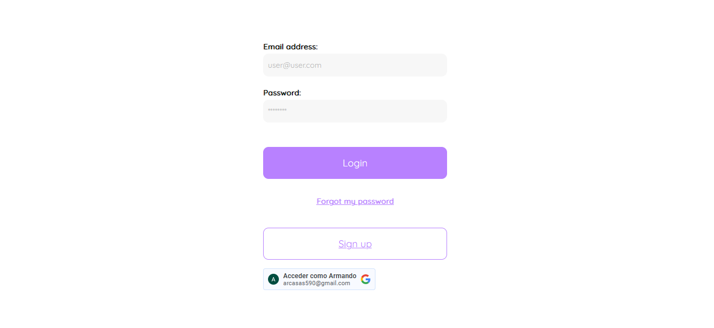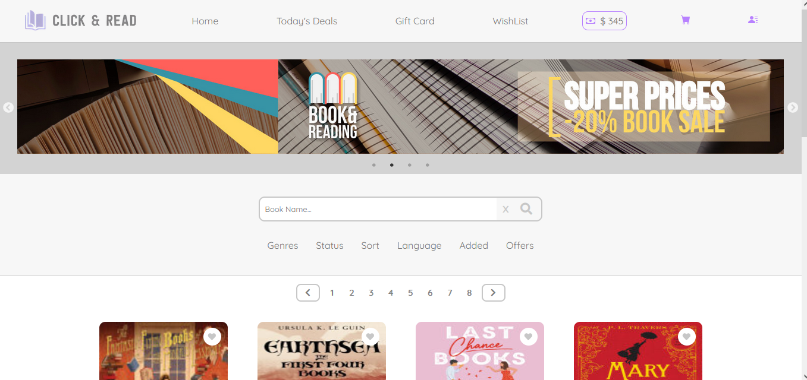
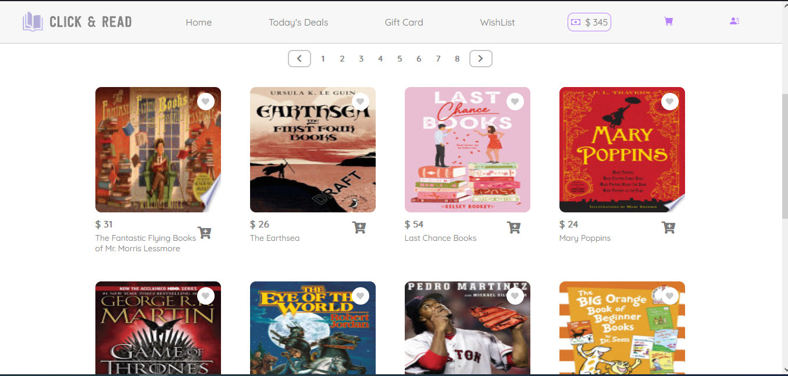
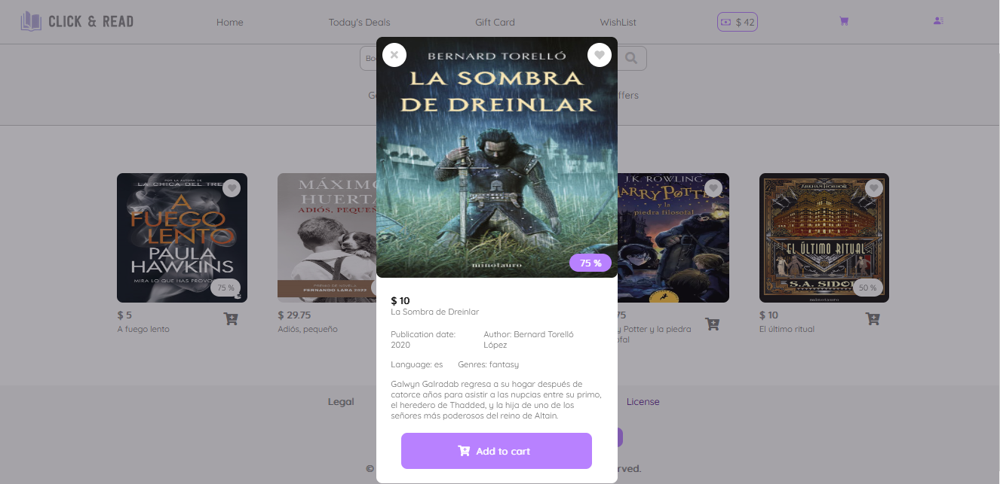
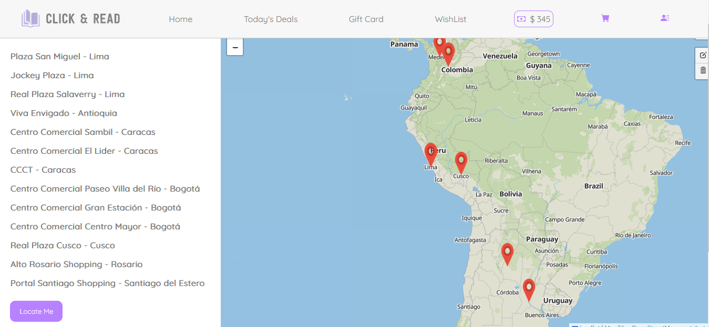
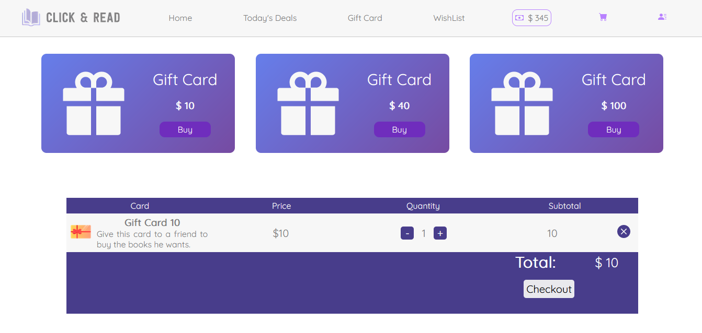
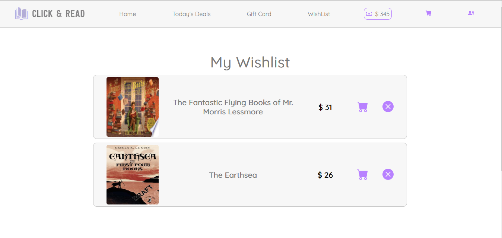
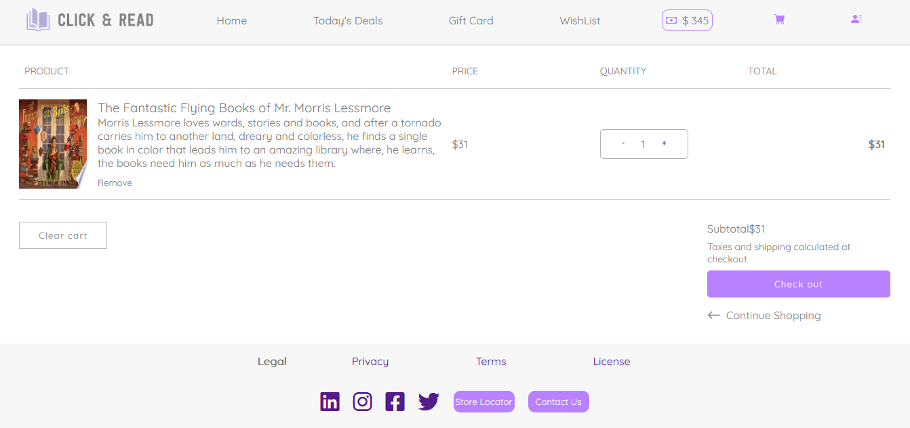
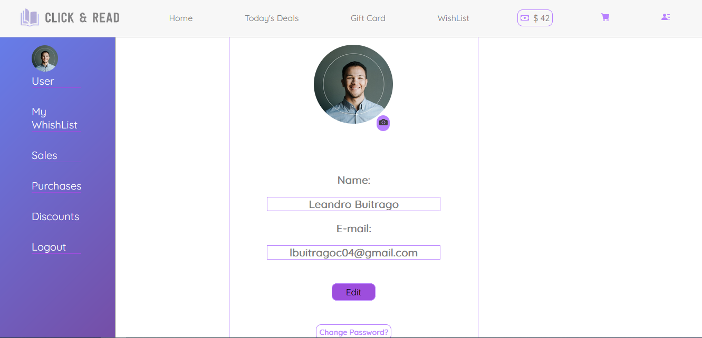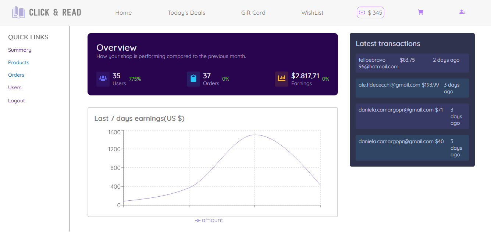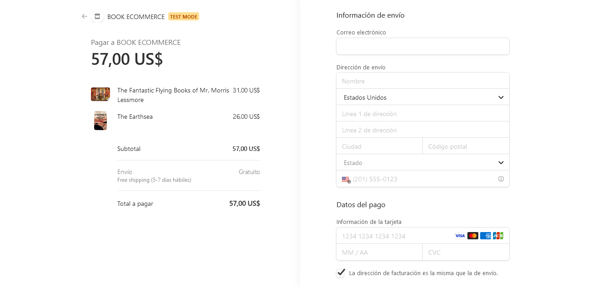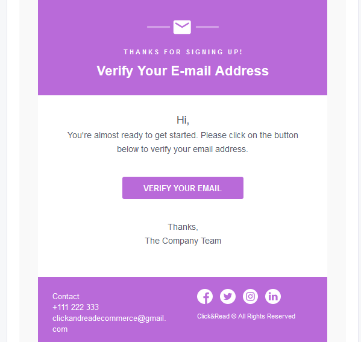

---
## Deploy 

https://ecommerce-lac-nu.vercel.app/

---
## Contributors 🧩

* [Felipe Bravo](https://github.com/Felipebravo-96)
* [Daniela Camargo](https://github.com/Danicp19)
* [Danny Hermoso](https://github.com/dannyhermoso)
* [Diego Carcausto](https://github.com/krqui)
* [Alejandro Fidececchi](https://github.com/alefidececchi)
* [Samir Antonio José](https://github.com/mihue14)
